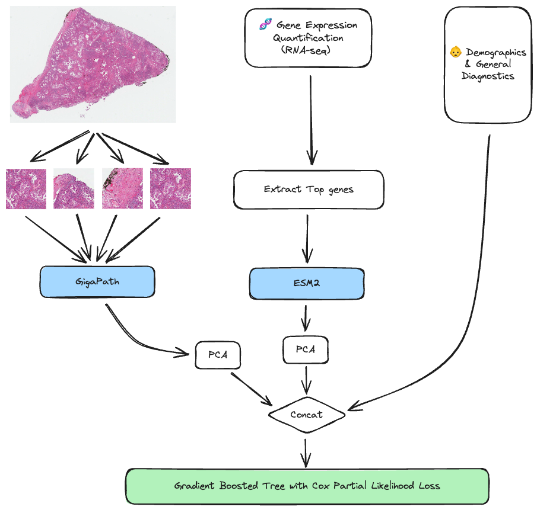

# Predicting Survival on TCGA-LUAD using Pathology Foundation Models and Protein Language Models

This repo holds all the code for my final project for [CS 286](https://web.stanford.edu/class/biods276/) at Stanford.

The csv file `data/case_data_filtered.csv` contains all the basic information for our TCGA-LUAD cohort. `data_utils.py` and `wsi_processing.py` contain all code relevant for preprocessing. `modeling.py` holds most of the modeling code and `modeling.ipynb` can be used to run all experiments for the project. `scrap.ipynb` is just for scrap work and can be ignored.

Below is a diagram of the general modeling setup:




## Best Hparams
This section contains the hyperparameters used for each of the experiments conducted.

### Demo only
```
    learning_rate=1,
    n_estimators=200,
    subsample=0.8,
    min_samples_leaf=4,
    max_features=0.5,
    dropout_rate=0.1,
    random_state=SEED
```

### WSI only
Uses 5 feats:
```
    learning_rate=1,
    n_estimators=200,
    subsample=1,
    min_samples_leaf=8,
    max_features=0.8,
    max_depth=3,
    dropout_rate=0.2,
    random_state=SEED
```

### Omics only
Uses 5 feats:
```
    learning_rate=1,
    n_estimators=200,
    subsample=0.8,
    min_samples_leaf=4,
    max_features=0.3,
    max_depth=3,
    dropout_rate=0.2,
    random_state=SEED
)
```

### Demo + WSI
Uses 5 feats for WSI
```
    learning_rate=1,
    n_estimators=200,
    subsample=1,
    min_samples_leaf=8,
    max_features=0.5,
    max_depth=3,
    dropout_rate=0.2,
    random_state=SEED
```


### Demo + Omics
Uses 5 feats for Omics
```
    learning_rate=1,
    n_estimators=200,
    subsample=0.8,
    min_samples_leaf=4,
    max_features=0.3,
    max_depth=3,
    dropout_rate=0.2,
    random_state=SEED
```

### WSI + Omics
5 feats for both
```
    learning_rate=1,
    n_estimators=200,
    subsample=0.8,
    min_samples_leaf=4,
    max_features=0.3,
    max_depth=3,
    dropout_rate=0.2,
    random_state=SEED
```

### All
5 feats for both
```
    learning_rate=1,
    n_estimators=200,
    subsample=0.8,
    min_samples_leaf=4,
    max_features=0.3,
    max_depth=3,
    dropout_rate=0.2,
    random_state=SEED
```